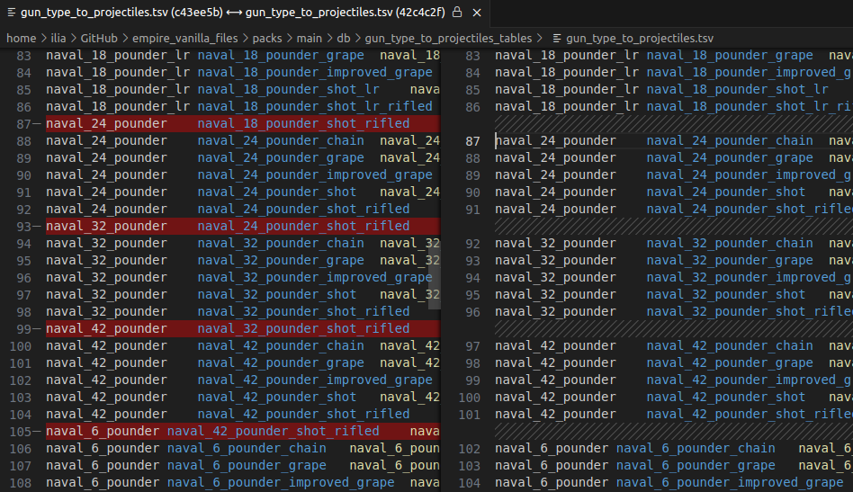

# Empire Vanilla Files

## The goal

This project is a collection of files and scripts I created to make modding Empire Total War easier and provide some convenience tools for the modders.

The repository contains many vanilla files converted into plain text formats using [Rusted Pack File Manager](https://github.com/Frodo45127/rpfm) and [taw's tools](https://github.com/taw/etwng), as well as a set of scripts to edit `.esf` files.

The files are slightly edited by me and include conservative small-scale fixes of bugs and oversights of vanilla. They can be used by any modder as a basis of his next project, if he wishes to start a mod from scratch.

## Pre-requisites

In order to be able to compile the files in this repository into usable form, you need to do the following things.

1. Install [Rusted Pack File Manager](https://github.com/Frodo45127/rpfm) and learn to use it. This tool is used to edit `.pack` files.

2. Install [taw's tools](https://github.com/taw/etwng) and learn to use it - especially the `esf2xml` tool. These tools can work with most types of files found in Empire Total War. The ones of the biggest interest to most would be the tools working with `.esf` files and groupformations.

## Vanilla files

### Packs

`packs` directory contains all the latest Empire DB records converted to `.tsv` format (using [Rusted Pack File Manager](https://github.com/Frodo45127/rpfm)), groupformations, English localisations and some other types of files, which are usually changed in mods.

The files include many small fixes and tweaks, such as [the fix for the notorious bug mapping naval cannons to projectiles they were not originally supposed to shoot](https://www.twcenter.net/forums/showthread.php?815804-Simple-naval-fix). This bug especially affects the 6-pounder naval cannons, which shoot 42-pounder shots in vanilla. One of the main effects of this fix is the reduction of vanilla Galleon firepower *from 370 to 130 (!)*.

Some other bug fixes included in the new version of the files:
- **Native American archers are re-enabled for recruitment** in 1700 and 1783 Grand Campaigns: in vanilla, they are erroneously locked behind a technology, which is only available in Warpath Campaign.
- **Churches are enabled** for construction by **Québec**, **México** and **Gran Colombia**.
- **Courland** allowed construction of **Protestant churches** instead of Catholic.
- Many factions received **audio language, character and ship names group fixes**: Louisiana now uses French names and speaks French, the Safavids now speak Persian instead of Arabic, etc.
- **Crimean Khanate, Georgia and Dagestan now use Ottoman troop rosters**.
- **Incorrect minor faction unit assignments** (resulting, for instance, in **ship duplication**) have been cleaned up.

And so on. The fixes are too numerous to list here, but each follows **one strict pattern**: none of them introduces any substantial "change" to the game, but is rather *a fix of a bug or an oversight*. This is done in order to keep the game as close to vanilla as possible.

### Campaigns

The `campaigns` directory contains all vanilla `.esf` files converted to sets of `.xml` files (using [taw's esf2xml tool](https://github.com/taw/etwng)) for easier plain text editing. Just like the pack files, these also received conservative convenience changes and bug fixes, such as:
- **Every faction made playable**.
- **FOW bug fixed** for minor factions (**including far-away fleets and armies**).
- Every faction received simple **victory conditions**, which you can tweak further.
- **Danish king's portrait** changed from 39 to 40: in vanilla, he shares the same portrait with the Swedish king.
- **Minor factions portraits** are fixed in preopen map info.
- **DLC unit resources are added to 1783 campaign**: in vanilla, many of the DLC units were unavailable in 1783 campaign due to lack of correct unit resources in the provinces.

And so on.

### Campaign maps

The `campaign_maps` directory contains all vanilla map files with all `.esf` files converted to sets of `.xml` files using [taw's esf2xml tool](https://github.com/taw/etwng).

## The flow

If you are making a completely new mod from scratch and plan using vanilla files, you can [download the entire repository](https://github.com/ilia-sharafutdinov/empire_vanilla_files/archive/refs/heads/master.zip) and simply keep editing it to create `.pack` and `.esf` files from the plain text files using [Rusted Pack File Manager](https://github.com/Frodo45127/rpfm) and [taw's tools](https://github.com/taw/etwng). The resulting set of `.pack` and `.esf` files can be compiled into a mod or included in an already existing work.

If you only wish to mod some parts of the game to further include them in another mod, you can pick whichever parts fit your goals and only work with them.

## Esf editing scripts

Finally, Empire Vanilla Files include a set of scripts which can be used to automate routine `.esf` editing tasks. The scripts are kept in `esf_scripts` directory and have [a manual of their own](/esf_scripts/README.md).

Some of the tasks the scripts can do:
- Changing and randomising character **names**, **birth dates** and **portraits**.
- **Handing over regions, armies and agents from one faction to another**.
- **Changing campaign starting date**, preserving all character ages.
- **Making emergent factions playable**.
- **Creating new governorships** in theatres where factions don't have a province yet.
- Changing **army compositions**.

And much more.

## [Proceed to the next tutorial](esf_scripts/README.md)
