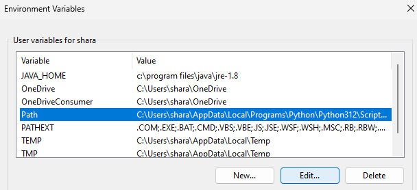
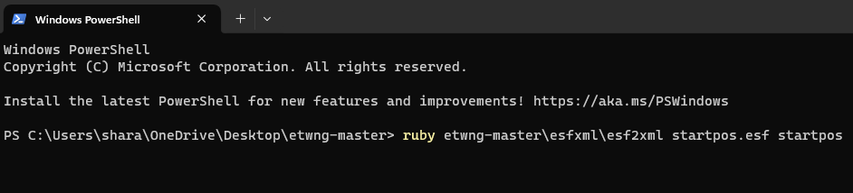

# ESF Scripts

## Pre-requisites

1. Install the latest **Python distribution**. Windows users can find it on [Python's official downloads page](https://www.python.org/downloads/windows/). If you have a 64 bit Windows system, it is advised to choose **"Download Windows installer (64-bit)"** option.

    **IMPORTANT:** When installing Python, make sure to enable **"Add Python to PATH"** option.

    

2. Install required **Python packages** by opening a command line and running the following command:  
`pip install lxml beautifulsoup4 python-dotenv numpy scipy pandas tqdm`

    

3. Install the latest **Ruby distribution**. Windows users can find it on [Ruby installer for Windows downloads page](https://rubyinstaller.org/downloads/). If you have a 64 bit Windows system, it is advised to choose **"Ruby+Devkit (x64)"** option.

4. Add Ruby to **Path**. In order to launch Ruby from anywhere on your computer without specifying it's absolute path, you need to add your `ruby.exe` location directory to `Path` environment variable.

    First, you need to find your Ruby installation directory. On Windows 11 x64, this directory is `C:\Ruby32-x64\bin`. Inside, you should see `ruby.exe` file. If you see it, it means you found the correct directory.

    

    Copy directory path. We will need it later.

    Now press "Search" in the bottom panel and start typing "environment". An option should appear, reading "Edit environment variables **for your account**".

    

    Click this option.

    You should now see a list of "User variables for yourusername". Left click `Path` variable and click "Edit..."

    

    You will be presented with a list of paths, which constitute the variable. Now click "New" to add Ruby installation directory.

    

    A new record will be created in the bottom. Now type your `ruby.exe` location, which you previously saved and press "Enter".

    

    When done, click "Ok" button on both screens to apply your changes.

5. Install required **Ruby packages** by opening a command line and running the following command:  
`gem install pry nokogiri paint`

    

6. Download the latest **taw's tools** repository version by going to it's [Github location](https://github.com/taw/etwng) and downloading it as an archive, pressing "Code" button and choosing "Download ZIP".

    

7. \[Optional\] Install the latest **VSCode** code editor. Windows users can find it on [VSCode's official downloads page](https://code.visualstudio.com/download). If you have a 64 bit Windows system, it is advised to choose **"User Installer x64"** option.  
VScode is an advanced **code editor**, almost akin to a proper integrated development environment (IDE), which simplifies script development. For those who never had any experienece in software development, you can imagine it to be a sort of a Notepad or Notepad++, but with tremendous amount of very powerful features.

8. \[Optional\] Install the latest **Git** version control system. Windows users can find it on [Git's official downloads page](https://git-scm.com/download/win). If you have a 64 bit Windows system, it is advised to choose **"64-bit Git for Windows Setup Standalone Installer"** option.  
Git as a **version control system**, allowing you to keep history of changes you make and compare one edition of your code to another.

    **IMPORTANT:** When installing Git, make sure to enable **"Add a Git Bash Profile to Windows Terminal"** option.

    

## The framework

Aside from `esf_scripts` directory, you can see several other directories included:

- `packs/main/db` directory keeps `.tsv` files created using [Rusted Pack File Manager](https://github.com/Frodo45127/rpfm). These files are slightly modified vanilla ones, designed to be used with vanilla. The files should contain all the correct records which you are going to use in your mod. For instance, if you wish to make `crimean_khanate` use `names_ottoman` instead of `names_muslim_general` when generating random character names - you should edit the file to represent that. If you wish to add a new faction key, you should add the new faction record to `factions.tsv`.

- `campaigns/main/startpos` directory contains the entire 1700 grand campaign startpos converted into a set of `.xml` files using [taw's esf2xml tool](https://github.com/taw/etwng). You will need that tool further on after applying all needed modifications to create the final `startpos.esf` file to be used in your mod.

Inside `esf_scripts` directory, you can find `.env` file: this file is a set of global variables which you can edit. This list contains all path references and explicitly tells the script where to search for the aforementioned `packs/main/db` and `campaigns/main/startpos` directories and which files to use for reference when quering names and factions information.

If you wish, for instance, to edit the late 1783 startpos instead of the early one, simply replace this string:  
`STARTPOS_DIR=../campaigns/main/startpos`  
With this:  
`STARTPOS_DIR=../campaigns/main_2/startpos`  
Or, alternatively, simply unpack your custom startpos to a directory of your liking using `esf2xml` and edit the `.env` file to direct to your unpacked startpos.

Same applies to names and factions `.tsv` file paths.

## The master script

### Structure

The next step is to create a **master script**: this is the `.py` file, where the main bulk of your work will be done.

In this tutorial, let's specifically look at [`master_example.py`](master_example.py).

The master script consists of several sections:

- **Imports and initialisation**: this section imports all required libraries and initialises global variables. You should never edit this section.

  

- **User-defined flow**: this is the main section of the script, where you define your custom commands, which will be executed, applying changes to the startpos. The section starts with a `User-defined flow start` comment and ends with a `User-defined flow end` comment. This is the only section you need to manually edit. `master_example.py` contains many examples of the functions and flows you could use to create your own custom campaign.

  *It is advised to refer to [`master_example.py`](master_example.py) and familiarise with it as closely as you can*.

  

  *Those, who successfully went though the entire `master_example.py`, tried it and understood how it works, can go further and try familiarising with [`master_1830.py`](master_1830.py) - a scipt I'm planning to use to create the 1830 campaign for Foothold in India*.

- **Finalisation**: this section clears recruitment IDs of each region you handed over to another faction and also creates optional tables with ID information, which you can find inside `esf_scripts/temp` folder. You should never edit this section.

  

### Workflow

The master script should be launched by opening a command line inside `esf_scripts` directory and running the following command:  
`python master_example.py`  
*\[Replace `master_example.py` with a different name of your liking if you're writing your own script.\]*

After executing the example script and comparing the original files in `campaigns/main/startpos` directory with the modified ones, you will see that the files have changed. The change is the result of the script run.

*It is highly recommended to use **git** in order to track the changes you apply and to be able to roll them back easily without having to constantly make back-ups.*

Now that the changes are applied, you can proceed to compile them back into a `startpos.esf` file which you can use in your mod or continue to modify the files manually.

**Take note**: the script should be run **only once**. If you run the script once but are not satisfied with the changes, you should remove the `campaigns/main/startpos` directory, restore it from back-up and then re-run the script.

*The advised flow is to make as many manual changes as possible first, then make a back-up and then experiment with scripted changes till perfection. This reduces the amount of effort you spend after every script execution.*

**One important tip**: install the latest python linter extension in whichever IDE you are using to work with the scripts (I personally prefer VSCode).

This will make understanding the functions much easier, since you will see the examples for each function and the set of arguments they accept.

## Limitations

Unfortunatelly, the current version of the scripts has certain limitations:
- You can't **remove armies and agents**, but you can change troop types and hand them to other factions. I personally don't find this to be a big problem, since the campaigns have a balanced number of armies and units, which can simply be redistributed among factions and regions to your liking.
- You can't **add trade routes** - this is too complicated. The best way is to start the game, make a trade agreement and then save the game, extract the trade route from the save game and insert it into your startpos. I tested it a lot for quite some time, and it works perfectly.
- Same situation with **initial FOW** in handed regions in some cases - you need to either move your armies or press the end turn button, and FOW will disappear. Alternatively, start the campaign on easy difficulty level. Don't move any army or agent. End turn to clear the FOW. Now, save the game. Copy faction quadtrees from the save game and use them to overwrite the ones in the startpos.
- You can't **randomise initial character traits and ancillaries** - this is complicated, since the triggers have to be read from `.lua` files rather than from the DB.
- You can't **unemerge an already emerged town**.
- You can't **unemerge an already emerged faction** (however, you can work around this by exchanging an emergent faction for a non-emergent).
- You can't **remove a faction's governorship** over any of the theatres it governs. However, you can either switch a governorship's theatre, which allows to change faction home theatres moving them from one theatre to another.

## Roadmap

- Research possibilities to:
  + add a new agent or army to startpos,
  + disable governorships,
  + remove armies and agents,
  + make factions emergent,
  + exchange faction ministers,
  + exchange faction governments,
  + exchange faction technology trees,
  + exchange faction families,
  + add and remove family members.
- Rewrite everything in the style of EsfXmlEtree.
- Refactor building slot addition scripts.
- Fix some minor cosmetical stuff in family trees when changing a character name, age or portrait.
- Enable usage of royalty names when renaming monarchs.
- Enable usage of esf portrait allocator instead of a preset dictionary to automatically generate portraits.
- Implement proper handover of forts (not critical).
- Automate family member changes.
- Automate new faction addition.
- Automate electoral period changes.
- Automate victory conditions change.
- Automate CAI regions needed for victory change.
- Automate fleet unit type changes and additions.
- Automate ID generation.
- Automate removal of trade routes when handing regions.
- Automate region wealth change.
- Automate region population changes.
- Automate character traits and ancillaries changes.
- Properly work with .env and improve overall structure
- Create the following high-level functions:
  + exchange everything except CAI and BDI between two factions,
  + clear an entire faction's diplomatic relationships,
  + hand over a region and all armies inside it,
  + hand over a region and all armies and agents inside it.

## How to use taw's esf2xml

[taw's esf2xml tool](https://github.com/taw/etwng) is a set of Ruby scripts, allowing modders to unpack `.esf` files into sets of annotated `.xml`-files, which can be further edited and repacked back into `.esf` format for usage in mods.

**IMPORTANT:** Before proceeding, make sure that you completed steps 3, 4 and 5 of [pre-requisites installation](#pre-requisites), installing **Ruby and all necessary Ruby packages**.

First, you need to download the latest **taw's tools** repository version by going to it's [Github location](https://github.com/taw/etwng) and downloading it as an archive, pressing "Code" button and choosing "Download ZIP".

Save the archive anywhere on your computer. In this case, let's save it to desktop.

Unpack the archive.

Now open the unpacked directory. Inside you should see another directory. This is the folder, where all code from taw's repository is stored. `esf2xml` and `xml2esf` executables will be located under `etwng-master\esfxml` path.

Now go to your game's installation directory and copy `startpos.esf` from `Empire Total War\data\campaigns\main` folder to the folder where you are currently located. We will be further applying modifications to this startpos.

Now we need to unpack this startpos into a set of `.xml`-files. In order to do this, you need to first open the **command line**. Both executables are **Ruby scripts**, and we will need to call Ruby from command line in order to execute them.

Press the right mouse button anywhere inside the folder and right click. Then click **"Open in Terminal"**.

A **terminal** (or **command line**) should appear. Inside it, you need to type `ruby` or `ruby.exe` as the main executable program and provide it the 3 following arguments:
- Relative path to `esf2xml` script, which in our case is located in `etwng-master\esfxml\esf2xml`.
- Relative path to startpos - in our case, `startpo.esf`.
- Relative path to output folder. Let's save the output to `startpos` folder. It will be created during script execution.

**ATTENTION:** The output folder should not exist before running the script, otherwise the command will fail.

Now type the complete command into the terminal:  
`ruby etwng-master\esfxml\esf2xml startpos.esf startpos`

And press Enter.

Script execution may take time. On various systems, I experienced anywhere from less than 1 minute and up to 10 minutes depending on system specifications.

**ATTENTION:** Do not close the command line while the script is running.

The script should not produce any output. You shall know, that the script finished executing, when `PS C:\Users\...\Desktop\etwng-master>` line appears again under the line where you typed the command.

Now go back to the etwng-master directory. Inside it, you will see a new folder called `startpos`.

This is the output folder, produced by the script by unpacking `startpos.esf` into a set of `.xml`-files.

Go inside startpos directory. Inside you will see a structured representation of the startpos in human-readable form of folders and `.xml` files.

Let's try making a simple mod. Go inside `factions` folder and open `denmark.xml` using Notepad. Search for the word **"Major"**.

By changing the **xml node** name from "no" to "yes", we can make Denmark a major faction, acquiring 3000 universal basic income instead of 1750 and listed as major in diplomacy panel.

Change the node name from "no" to "yes" and save the file (ctrl+s).

Now let's repack the `.xml`'s back into `.esf` form. Go back to **command line** and now run another command by typing it into the terminal and pressing Enter:  
`ruby etwng-master\esfxml\xml2esf startpos modded_startpo.esf`

This command will take all `.xml`'s from `startpos` folder as inputs and compile them into `modded_startpo.esf` file.

Wait for the command to finish executing.

Now go back to `etwng-master` directory. Inside you will find the newly created `modded_startpo.esf` file.

This file is a completely functional startpos which you can now use to replace the one in the game's installation directory.

If you rename it to `startpos.esf`, put it into `Empire Total War\data\campaigns\main` overwriting the original one (don't forget to make **a backup!**) and try starting the Grand Campaign, you should see that Denmark is listed as a major faction in diplomacy panel.

## [Proceed to the next tutorial](tutorials/01_simple_modifications/README.md)
