# Tutorial 1: Simple modifications

In this tutorial we will learn to:
- Edit the master script, adding simple commands
- Run the master script to execute the commands

## Editing the master script

The most important file you will be working it is `master.py`. Let's agree to call it "master script".

The master script contains all commands you will need to run to make all necessary modifications to a startpos.

Try opening `master.py` found in the same directory as this `README.md`.

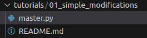

And search for a line reading `User-defined flow start`.

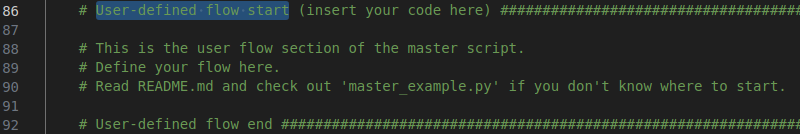

This is the only section you need to edit manually.

Try typing `change_faction_majority` in one of the line between the comment sections (designated by `#` sign).

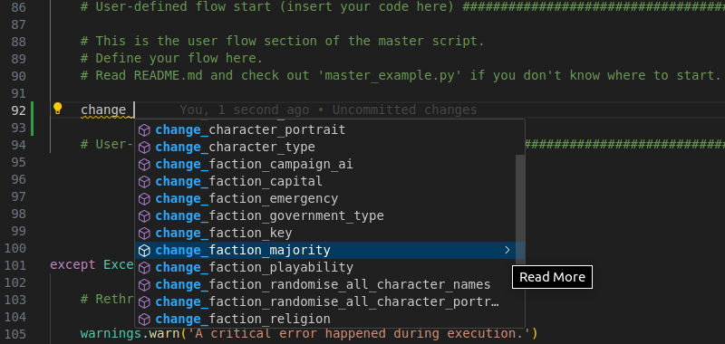

If you use VSCode with Python extensions installed, it will provide you hints while you're typing on the go.

*TIP: Use VSCode or any other IDE/advanced text editor to increase productivity.*

`change_faction_majority` is a function, which makes a faction either minor or major. In vanilla, minor factions earn **1750** initial "other" universal basic income, while major factions earn **3000**. Also, major factions show up as major in diplomacy panel.

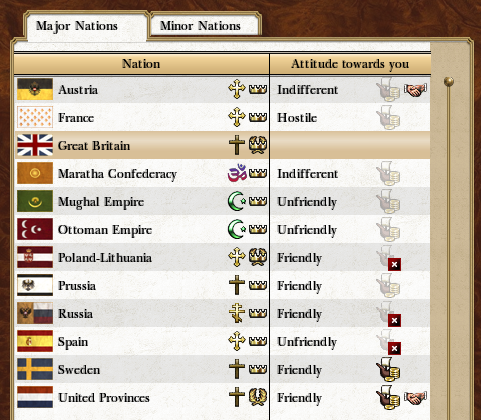

If you open **circle brackets** (or **"parenthesis"**) right after the function's name, VSCode will hint you on the **arguments** of the function and show you a function usage example.

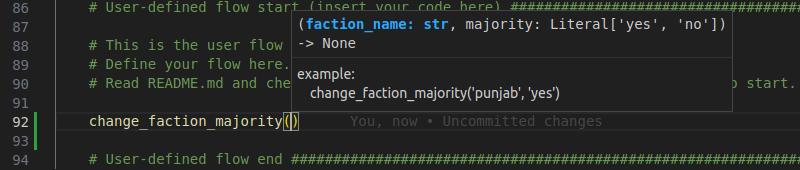

**Function arguments** are parameters, which you need to provide to a function in order to make it work properly. Some functions may not require any arguments, but the absolute majority of functions we will be using do require them.

`change_faction_majority` function requires two argumens:
- `faction_name` - faction key as found in `db/factions_tables` in **Rusted Pack File Manager**.
- `majority` - either `'yes'` or `'no'` (you can see the VSCode hinting this on the screenshot above). `'yes'` makes the faction major, while '`no`' makes the faction minor.

For tutorial purposes, let's make Denmark major.

In order to achieve this, we'll need to deduce Denmark's `faction_name`. It corresponds to `key` column in `db/factions_tables`. You can find the extracted vanilla tables in [empire_vanilla_files/packs/main/db/factions_tables](../../../packs/main/db/factions_tables/factions.tsv).

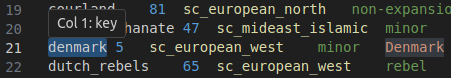

*TIP: VSCode users can install **Rainbow CSV** extension to get their `.tsv`-files nicely annotated.*

Now that we know, which `faction_name` to provide, let's finish writing the function. Your final result should like like the following:  
`change_faction_majority('denmark', 'yes')`

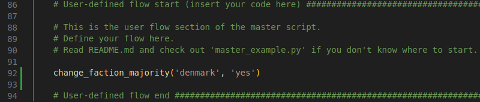

Don't forget to **save** (ctrl+s) the edited file.

## Running the master script

The master script's main and only purpose is to edit a set of `.xml`-files provided by a user. By default, the script is copying files located in [empire_vanilla_files/campaigns/main/startpos](../../../campaigns/main/startpos) directory to [empire_vanilla_files/esf_scripts/temp/startpos](../../temp/startpos) and then changes files inside the latter. This directory contains a set of `.xml`'s generated by unpacking vanilla `data/campaigns/main/startpos.esf` using taw's `esf2xml` tool.

By default, faction declarations are located in [empire_vanilla_files/campaigns/main/startpos/factions](../../../campaigns/main/startpos/factions) directory. Try opening [denmark.xml](../../../campaigns/main/startpos/factions/denmark.xml) and searching for the word "Major".

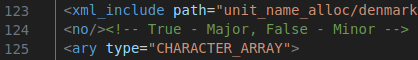

As you can see, the `.xml` node, annotated as being relevant to faction majority, is set to 'no'. By setting it to 'yes' you can change Denmark's status from minor to major.

The function we added to the master script, `change_faction_majority('denmark', 'yes')`, should automatically find that node and set it to 'yes'.

Let's run the master script now. Open **command line** inside the same directory where this `README.md` and `master.py` are found (consult Google if you don't know how to open a command line) and run the following command by typing it into the command line and pressing Enter:  
`python master.py`.

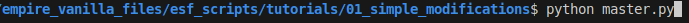

**IMPORTANT: Don't close the command line until the script has finished executing.**

In the command line, you should start seeing output, similar to the one on the screenshot. Execution make take time and the time of execution depends on complexity of the functions used.

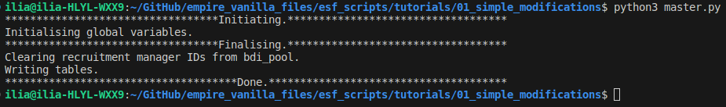

`***Done.***` line indicates that the script finished executing. Never interrupt the script before execution stops, unless you are 100% sure you know what you're doing.

*If your output is very different from the one on the script or contains **error messages**, double-check you set up everything correctly or contact me directly.*

Now, let's check whether the script worked correctly. Open [empire_vanilla_files/esf_scripts/temp/startpos/factions/denmark.xml](../../temp/startpos/factions/denmark.xml) and search for the word "Major".

If the script worked correctly, you should see the majority node changing from 'no' to 'yes'.

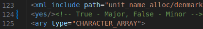

## Compiling the .esf

Now that we have a set of `.xml`-files with all modifications applied, we need to compile them back into `.esf` form using taw's **xml2esf** tool.

**xml2esf** takes two arguments:
- Unpacked startpos directory. In our case, it is [empire_vanilla_files/esf_scripts/temp/startpos](../../temp/startpos).
- Output `.esf`-file path.

Let's compile the startpos into a form of `.esf`, which can be used to replace the original `startpos.esf` in the game.

Open command line from inside [empire_vanilla_files](../../..) directory and run the following command:  
`ruby xml2esf esf_scripts/temp/startpos startpos.esf`

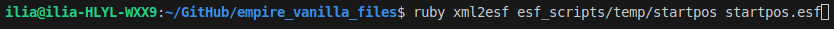

**IMPORTANT: Don't close the command line until xml2esf has finished executing.**

Compiling the startpos make time, depending on the system specifications. On various computers I've seen it running from under 1 minute and up to 10. If you're experiencing execution times longer than 10 minutes, most probably something is wrong.

As a result of this command run, a `startpos.esf` file should appear inside [empire_vanilla_files](../../..) directory.

Try replacing vanilla `data/campaigns/main/startpos.esf` file (**don't forget to make  a backup!**) with the one you compiled. As a result, the diplomacy screen in the grand campaign should start looking like on the screen below, with Denmark listed as major.

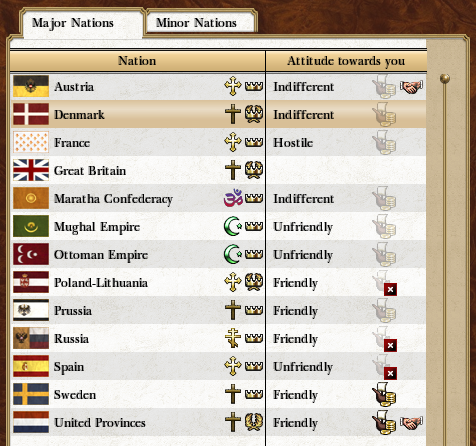
